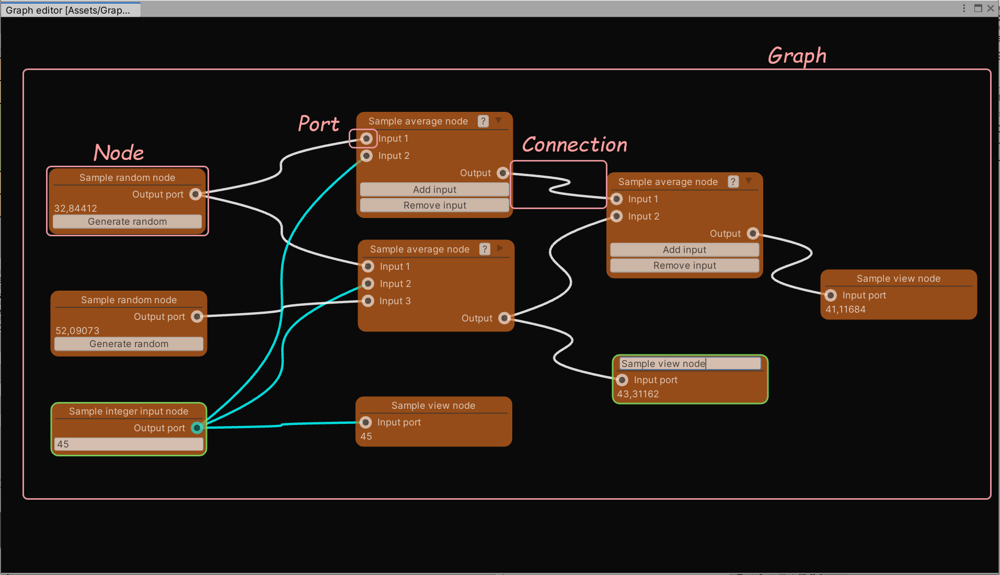
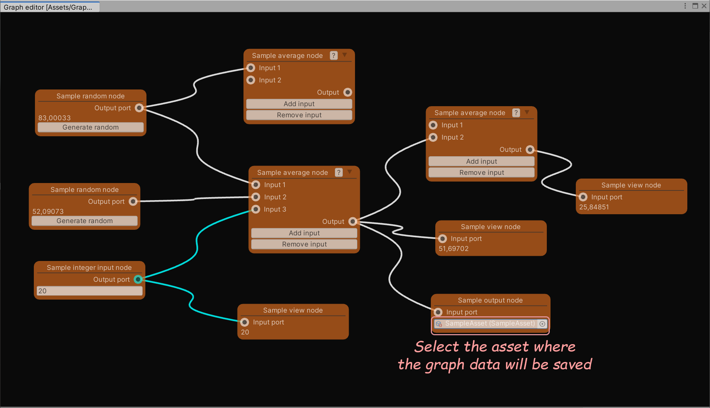

# Graph editor for Unity3d

[Graph editor Version 1.1.](http://u3d.as/22My)

Copyright (c) Marshalkin Aleksey <megalanthus@gmail.com>

[Asset store](https://assetstore.unity.com/publishers/50181)

[Github](https://github.com/megalanthus)


# Content
- [Introduction](#intro)
  - [Features](#intro-features)
  - [Nodes](#intro-node)
  - [Ports](#intro-port)
- [Getting started](#getting-started)
  - [Creating graph](#create-graph)
  - [Editor control](#editor-control)
  - [Context menu](#context-menu)
  - [Graph calculation](#calculate-graph)
- [Examples of custom graph scripts](#samples)
  - [Creating graph](#create-custom-graph)
  - [Creating port](#create-custom-port)
  - [Creating node data](#create-custom-node-data)
  - [Creating node](#create-custom-node)
  - [Linking data to a visual representation of a node](#bind-data)
  - [Associating ports with the visual representation of a node](#bind-port)
  - [Dynamically changing a node](#dynamic-change-node)  
  - [Outputting data from a graph to an asset](#output-data)
  - [Entering data into a graph from an asset](#input-data)
- [Attributes](#attributes)
  - [CreateAssetMenu](#attribute-create-asset-menu)
  - [Design](#attribute-design)
  - [GraphDesign](#attribute-graph-design)
  - [MinimizedDesign](#attribute-minimized-design)
  - [Node](#attribute-node)
  - [NodeHelp](#attribute-node-help)
  - [NodeTooltip](#attribute-node-tooltip)
  - [Port](#attribute-port)
  - [Serializable](#attribute-serializable)
- [Templates and styles](#template-and-styles)
  - [File naming](#template-and-styles-file-naming)
  - [Graph](#template-and-styles-graph)
  - [Node](#template-and-styles-node)
  - [Port](#template-and-styles-port)
  - [Connection](#template-and-styles-connection)
  - [Help popup](#template-and-styles-help-window)
- [Scripts](#scripts)
  - [GraphEditor.cs](#scripts-graph-editor)
  - [Graph.cs](#scripts-graph)
  - [Node.cs](#scripts-node)
  - [Port.cs](#scripts-port)
  - [Utils.cs](#scripts-utils)
- [Enumerations](#enums)
  - [PortDirection.cs](#enums-port-direction)
  - [PortTypeConnection.cs](#enums-port-type-connection)
- [Change history](#history)
  - [Version 1.0](#history-1-0)
  - [Version 1.1](#history-1-1)


<a name="intro"></a>
# Introduction
Graph editor is an extension for Unity3d. Allows you to create custom node-based graphs. Can be used to calculate data or create graph based assets. The graph is saved as a single asset file.




<a name="intro-features"></a>
## Features
- For the editor only (not for runtime mode!).
- Based on [UIElements](https://docs.unity3d.com/Manual/UIElements.html).
- Undo/redo is supported.
- Graph scaling.
- Graph autoscrolling when dragging/connecting nodes.
- Automatic graph calculation.
- Expandable graph and node context menu.
- Easy creation of custom nodes.
- Renaming nodes.
- Group move/clone/delete graph nodes.
- Possibility to connect ports of various types.
- Highlight port connectivity when capturing a port.
- Full customization of appearance using uxml templates and uss styles.
- Separate templates for normal/collapsed node state.
- Ability to create tooltips and help popups for nodes.
- Automatically instantiate data for a node.
- Different event handlers allow you to implement different additional functionality.


<a name="intro-node"></a>
## Nodes
Each node has its own data fields. Each node can have an arbitrary number of ports. Graph nodes can be connected using ports. When calculating a graph, data between nodes is transmitted through ports.


<a name="intro-port"></a>
## Ports
Ports are used to connect nodes. Each node port has its own type, direction (in/out), and connection type (single/multiple). Ports can be of different types. Port names must be unique within a single node.

Port connection rules:
- Ports with the same direction cannot be connected.
- A port with a single connection type can only be connected to one port.
- By default, ports of different types cannot be connected. To allow connection of ports of different types, you must override the [CanConnectPorts](#scripts-graph-can-connect-ports)


<a name="getting-started"></a>
# Getting started


<a name="create-graph"></a>
## Creating graph
There are two ways to create a graph asset (when creating a custom graph, the menu path can be changed):
1. Through the main menu Assets->Create->Graph->Sample graph.
2. Through the context menu Create->Graph->Sample graph.


<a name="editor-control"></a>
## Editor control
In the editor window:
- **Left mouse button**: select a node.
- **Left mouse button + drag**: rectangular selection of nodes.
- **Shift + Left mouse button**: add a node to the selected ones.
- **Ctrl + Left mouse button**: moving the graph.
- **Middle mouse button + drag**: moving the graph.
- **Right mouse button**: context menu.
- **Mouse wheel**: change the graph scale.
- **+**: zoom in the graph.
- **-**: zoom out the graph.
- **/**: reset the graph scale.
- **Delete**: remove selected nodes.
- **Shift + Delete**: break all connections of the selected nodes.
- **Ctrl + D**: clone selected nodes.

In the node window:
- **Left mouse button + drag**: moving the selected nodes.
- **Right mouse button**: context menu.
- **Double click with the left mouse button on the header**: renaming a node.

At the port:
- **Left mouse button**: creating a connection with another port.
- **Right mouse button**: break all connections for the current port.


<a name="context-menu"></a>
## Context menu
Editor context menu:
- **Create node**: create a node.
- **Set scale 100%**: set the graph scale to 100%. 
- **Calculate graph**: recalculate the graph.

Node context menu:
- **Clone node** - clone the selected nodes.
- **Remove node** - delete selected nodes.
- **Disconnect all ports** - break all connections of the selected nodes.
- **Calculate node** - recalculate a node and all its dependent nodes.

To add custom menu items, you need to override the OnCreateContextMenu method of the [graph](#scripts-graph-on-create-context-menu) or [node](#scripts-node-on-create-context-menu).

Example of adding a menu, SampleAverageNode.cs:
```cs
namespace GraphEditor.Samples
{
    public class SampleAverageNode : Node
    {
        public override void OnCreateContextMenu(DropdownMenu dropdownMenu)
        {
            dropdownMenu.AppendSeparator();
            dropdownMenu.AppendAction("Add input", action => AddInput());
            dropdownMenu.AppendAction("Remove input", action => RemoveInput());
        }

        private void AddInput()
        {
            string portName = $"Input {CountInputPorts + 1}";
            CreatePort(typeof(SampleFloatPort), portName, PortDirection.Input, PortTypeConnection.Single);
            Synchronize();
        }

        private void RemoveInput()
        {
            if (CountInputPorts <= 2) return;
            RemovePort(InputPortsByType<SampleFloatPort>().Last());
            Synchronize();
        }
    }
}
```


<a name="calculate-graph"></a>
## Graph calculation
The graph is calculated automatically. If the graph is looped, then a partial calculation will be performed, and a warning will be displayed in the console.

The graph is completely recalculated when:
- opening the graph.
- after undo/redo operation.
- method call [ForceCalculateGraph](#scripts-graph-force-calculate-graph).
- when selecting the 'Calculate graph' context menu item.
- when you click on the Calculate graph button in the inspector window (it makes sense if an asset is generated during the graph calculation or changes are made in the project).

Partial graph recalculation is performed:
- when connecting/disconnecting ports.
- method call [Calculate](#scripts-node-calculate).
- when selecting the 'Calculate node' context menu item.

Calculation and data transfer to output ports must be done in the overridden [OnCalculate](#scripts-node-on-calculate) method. The data passed to the port is not serialized and will not be stored in the graph asset.

SampleAverageNode.cs:
```cs
namespace GraphEditor.Samples
{
    public class SampleAverageNode : Node
    {
        //In the calculation method, we calculate the average value and write the data to the output port
        public override void OnCalculate()
        {
            FindPortByName<SampleFloatPort>(OutputPort).Value = GetAverage();
        }

        private void AddInput()
        {
            string portName = $"Input {CountInputPorts + 1}";
            CreatePort(typeof(SampleFloatPort), portName, PortDirection.Input, PortTypeConnection.Single);
            Synchronize();
            //After adding a new port, we will recalculate the node
            Calculate();
        }

        private float GetAverage()
        {
            double average = 0;
            foreach (SampleFloatPort port in InputPortsByType<SampleFloatPort>()) average += port.Value;
            return (float) (average / CountInputPorts);
        }
    }
}
```

SampleViewNode.cs:
```cs
namespace GraphEditor.Samples
{
    public class SampleViewNode : Node
    {        
        public override void OnCalculate()
        {
            UpdateValue();
        }

        //save the data read from the port
        private void UpdateValue()
        {
            SampleFloatPort inputPort = FindPortByName<SampleFloatPort>(InputPort);
            Data.Value = inputPort.Value;
        }
    }
}
```

<a name="samples"></a>
# Examples of custom graph scripts
Sample files can be found in the Samples directory.
- **SampleGraph.cs**: graph class.
- **SampleIntInputNode.cs**: node class (input of integer values).
- **SampleIntInputNodeData.cs**: data class for the SampleIntInputNode node.
- **SampleRandomNode.cs**: node class (generating a random floating point number).
- **SampleRandomNodeData.cs**: data class for the SampleRandomNode node.
- **SampleAverageNode.cs**: node class (average calculation).
- **SampleViewNode.cs**: node class (viewing the resulting value).
- **SampleViewNodeData.cs**: data class for SampleViewNode.
- **SampleOutputNode.cs**: node class (output of the received value).
- **SampleOutputNodeData.cs**: data class for SampleOutputNode.
- **SampleIntPort.cs**: port class (passing integer values).
- **SampleFloatPort.cs**: port class (transfer of floating point values).
- **SampleAsset**: Asset class (Asset data is generated using SampleOutputNode).


<a name="create-custom-graph"></a>
## Creating graph
- Create a script and inherit from [Graph](#scripts-graph).
- Add [Serializable](#attribute-serializable) attribute.
- Add [CreateAssetMenu](#attribute-create-asset-menu) attribute.

Optional:
- Create a uss style for the graph.
- Add [GraphDesign](#attribute-graph-design) attribute.

SampleGraph.cs:
```cs
using System;
using GraphEditor.Core;
using GraphEditor.Core.Attributes;
using UnityEngine;

namespace GraphEditor.Samples
{
    [Serializable]
    [CreateAssetMenu(fileName = "SampleGraph", menuName = "Graph/Sample graph", order = 5000)]
    [GraphDesign("Samples/SampleGraphStyle.uss")]
    public sealed class SampleGraph : Graph
    {
    }
}
```

SampleGraphStyle.uss:
```css
.graph {
    background-color: rgb(10, 10, 10);
}
```


<a name="create-custom-port"></a>
## Creating port
- Create script and inherit from [Port](#scripts-port).
- Add [Serializable](#attribute-serializable) attribute.

Optional:
- Create uxml template and uss style for port.
- Add [Design](#attribute-design) attribute.

SampleIntPort.cs:
```cs
using System;
using GraphEditor.Core;
using GraphEditor.Core.Attributes;

namespace GraphEditor.Samples
{
    [Serializable]
    [Design("Samples/SamplePort.uxml", "Samples/SampleIntPortStyle.uss")]
    public sealed class SampleIntPort : Port
    {
    }
}
```

SamplePort.uxml:
```xml
<UXML xmlns="UnityEngine.UIElements">
    <VisualElement class="pin"/>
</UXML>
```

SampleIntPortStyle.uss:
```css
.port {
    background-color: aqua;
}

.pin{
    background-color: black;
    flex-grow: 1;
    border-radius: 4;
}
```


<a name="create-custom-node-data"></a>
## Creating node data
- Create a script and inherit from ScriptableObject.
- Add [Serializable](#attribute-serializable) attribute.
- Add data fields.

SampleViewNodeData.cs:
```cs
using System;
using UnityEngine;

namespace GraphEditor.Samples
{
    [Serializable]
    public class SampleViewNodeData : ScriptableObject
    {
        public float Value;
    }
}
```


<a name="create-custom-node"></a>
## Creating node
- Create a script and inherit from [Node](#scripts-node).
- Add [Serializable](#attribute-serializable) attribute.
- Add [Node](#attribute-node) attribute.
- Specify the type of data to be used by the node.
- Create uxml template and uss style (optional) for node.
- Add [Design](#attribute-design) attribute.

Optional:
- Create a collapsed state uxml template and a uss style for the node.
- Add [MinimizedDesign](#attribute-minimized-design) attribute.
- Create uxml template and uss style for node for popup help.
- Add [NodeHelp](#attribute-node-help) attribute.
- To create a tooltip add the [NodeTooltip](#attribute-node-tooltip) attribute.
- Add the [Port](#attribute-port) attribute to automatically create node ports.

SampleViewNode.cs:
```cs
using System;
using GraphEditor.Core;
using GraphEditor.Core.Attributes;

namespace GraphEditor.Samples
{
    [Serializable]
    [Node("Sample view node", typeof(SampleGraph))]
    [Design("Samples/SampleViewNode.uxml", "Samples/SampleNodeStyle.uss")]
    [Port(typeof(SampleFloatPort), InputPort, PortDirection.Input, PortTypeConnection.Single)]
    public class SampleViewNode : Node
    {
        private const string InputPort = "Input";

        //Specifying the data type
        public override Type TypeNodeData => typeof(SampleViewNodeData);
        
        //Override the field for more convenient data access
        public new SampleViewNodeData Data => (SampleViewNodeData) base.Data;
    }
}
```

SampleViewNode.uxml:
```xml
<UXML xmlns="UnityEngine.UIElements" xmlns:ge="GraphEditor.UIElements">
    <VisualElement class="node-row">
        <ge:PortVisual name="Input"/>
        <Label class="port-label" text="Input port"/>
        <VisualElement class="node-spacer"/>
    </VisualElement>
    <Label binding-path="Value"/>
</UXML>
```

SampleNodeStyle.uss:
```css
.node {
    background-color: chocolate;
    opacity: 0.7;
}

.node-selected {
    border-color: rgb(106, 255, 114);
}

.title-text, .unity-label {
    color: rgb(255, 255, 255);
    padding: 0 4;
}

.port-label {
    color: rgb(255, 255, 255);
    -unity-text-align: middle-center;
}

.node-row {
    flex-direction: row;
}

.node-spacer {
    flex-grow: 1;
}
```


<a name="bind-data"></a>
## Linking data to a visual representation of a node
Fields of the uxml template with the binding-path attribute will be automatically linked to the node data.

SampleViewNode.uxml:
```xml
<UXML xmlns="UnityEngine.UIElements" xmlns:ge="GraphEditor.UIElements">
    ...
    <Label binding-path="Value"/>
</UXML>
```

A label with the binding-path="Value" attribute will be bound to the data of the corresponding SampleViewNode.Data.Value node.


<a name="bind-port"></a>
## Associating ports with the visual representation of a node
Ports will be linked automatically to node ports by name. PortVisual is a visual element of a port, located in the GraphEditor.UIElements space.

SampleViewNode.uxml:
```xml
<UXML xmlns="UnityEngine.UIElements" xmlns:ge="GraphEditor.UIElements">
        ...
        <ge:PortVisual name="Input"/>
        ...
</UXML>
```
The port named Input will be associated with the <ge:PortVisual name = "Input"/> visual element of the template.


<a name="dynamic-change-node"></a>
## Dynamically changing a node
In the [OnCreateContent](#scripts-node-on-create-content) method, subscribe to button events. In button handlers, after creating/deleting additional ports, call the [Synchronize](#scripts-node-synchronize) method.

```cs
namespace GraphEditor.Samples
{
    public class SampleAverageNode : Node
    {
        public override void OnCreateContent(VisualElement nodeVisual)
        {
            Button addInputButton = nodeVisual.contentContainer.Q<Button>("add-input");
            if (addInputButton != null) addInputButton.clicked += AddInput;
            Button removeInputButton = nodeVisual.contentContainer.Q<Button>("remove-input");
            if (removeInputButton != null) removeInputButton.clicked += RemoveInput;
        }

        private void AddInput()
        {
            string portName = $"Input {CountInputPorts + 1}";
            CreatePort(typeof(SampleFloatPort), portName, PortDirection.Input, PortTypeConnection.Single);
            Synchronize();
            Calculate();
        }

        private void RemoveInput()
        {
            if (CountInputPorts <= 2) return;
            RemovePort(InputPortsByType<SampleFloatPort>().Last());
            Synchronize();
            Calculate();
        }
    }
}
```

In the [OnSynchronize](#scripts-node-on-synchronize) method, we synchronize the visual representation of the node with the data. When new ports appear, we add a visual representation, and remove for nonexistent ones.

```cs
namespace GraphEditor.Samples
{
    public class SampleAverageNode : Node
    {
        private const string BasePath = "Samples/";
        private const string NodeItemTemplateUxml = BasePath + "SampleAverageNodeItem.uxml";
        private const string TemplatePortClassUss = "template-port";

        public override void OnSynchronize(VisualElement nodeVisual)
        {
            VisualElement portContainer = nodeVisual.contentContainer.Q("port-container");
            portContainer.Query(classes: TemplatePortClassUss).ForEach(portVisual =>
            {
                if (FindPortByName(portVisual.name) == null) portVisual.parent.RemoveFromHierarchy();
            });
            foreach (Port port in InputPorts)
            {
                if (portContainer.Q(port.name) != null) continue;
                VisualElement template = Utils.LoadTemplate(NodeItemTemplateUxml);
                portContainer.Add(template);
                template.AddToClassList("node-row");
                template.Q(classes: TemplatePortClassUss).name = port.name;
                template.Q<Label>().text = port.name;
            }
        }
    }
}
```

Template SampleAverageNodeItem.uxml:
```xml
<UXML xmlns="UnityEngine.UIElements" xmlns:ge="GraphEditor.UIElements">
    <ge:PortVisual class="template-port"/>
    <Label class="port-label"/>
    <VisualElement class="node-spacer"/>
</UXML>
```


<a name="output-data"></a>
## Outputting data from a graph to an asset
An example of a graph generated asset, SampleAsset.cs:

```cs
using System;
using UnityEngine;

namespace GraphEditor.Samples
{
    [Serializable]
    [CreateAssetMenu(fileName = "SampleAsset", menuName = "Graph/Sample asset", order = 5000)]
    public class SampleAsset : ScriptableObject
    {
        public float SampleData;
    }
}
```

In the node data, create a link to the asset:

```cs
using UnityEngine;

namespace GraphEditor.Samples
{
    public class SampleOutputNodeData : ScriptableObject
    {
        public SampleAsset Asset;
    }
}
```

Data output using the SampleOutputNode node as an example:

```cs
namespace GraphEditor.Samples
{
    public class SampleOutputNode : Node
    {
        private const string InputPort = "Input";

        public override Type TypeNodeData => typeof(SampleOutputNodeData);
        public new SampleOutputNodeData Data => (SampleOutputNodeData) base.Data;

        //when creating a node, we specify the data type for the object selection field.
        public override void OnCreateContent(VisualElement nodeVisual)
        {
            ObjectField objectField = nodeVisual.Q<ObjectField>("asset");
            objectField.objectType = typeof(SampleAsset);
        }

        public override void OnChangeConnections()
        {
            UpdateAsset();
        }

        public override void OnCalculate()
        {
            UpdateAsset();
        }

        //outputting data to an asset file
        private void UpdateAsset()
        {
            SampleFloatPort inputPort = FindPortByName<SampleFloatPort>(InputPort);
            if (Data.Asset != null) Data.Asset.SampleData = inputPort.Value;
        }
    }
}
```

Template SampleOutputNode.uxml:
```xml
<UXML xmlns="UnityEngine.UIElements" xmlns:ue="UnityEditor.UIElements" xmlns:ge="GraphEditor.UIElements">
    <VisualElement class="node-row">
        <ge:PortVisual name="Input"/>
        <Label class="port-label" text="Input port"/>
        <VisualElement class="node-spacer"/>
    </VisualElement>
    <ue:ObjectField name="asset" binding-path="Asset" allow-scene-objects="false"/>
</UXML>
```

Create a new asset in the project directory via the Create-> Graph-> Sample asset menu. And select it in the SampleOutputNode node. Now, when calculating the graph, the data in the asset will be updated.



<a name="input-data"></a>
## Entering data into a graph from an asset
Entering data into the graph from the asset is performed in the same way as [data output](#output-data)


<a name="attributes"></a>
# Attributes
Description of attributes.


<a name="attribute-create-asset-menu"></a>
## Attribute CreateAssetMenu
Description of attributes. [Full description](https://docs.unity3d.com/ScriptReference/CreateAssetMenuAttribute.html).

Applicable for [graphs](#scripts-graph).


<a name="attribute-design"></a>
## Attribute Design
The attribute specifies the style of the node or port.

Applicable for [nodes](#scripts-node) and for [ports](#scripts-port)

**\[Design(Template, Style)\]**

- Template - path to the window template file.
- Style - the path to the style file.


<a name="attribute-graph-design"></a>
## Attribute GraphDesign
The attribute sets the style of the graph.

Applicable for [graphs](#scripts-graph).

**\[GraphDesign(Style, ConnectionWidth, MinScale, MaxScale)\]**

- Style - the path to the style file.
- ConnectionWidth - connection width, default 3.
- MinScale - minimum graph scale, default 0.3.
- MaxScale - maximum graph scale, default 1.


<a name="attribute-minimized-design"></a>
## Attribute MinimizedDesign
The attribute sets the style of the collapsed node.

Applicable for [nodes](#scripts-node).

**\[MinimizedDesign(Template, Style)\]**

- Template - path to the window template file.
- Style - the path to the style file.


<a name="attribute-node"></a>
## Attribute Node
The attribute specifies in which graphs the node can be used. To use a node in multiple graphs, an attribute must be added for each graph type.

Applicable for [nodes](#scripts-node).

**\[Node(MenuItem, TypeGraph)\]**

- MenuItem - the item will be added to the context menu of the TypeGraph graph in the 'Create node' section.
- TypeGraph - the type of graph in which the node will be used.


<a name="attribute-node-help"></a>
## Attribute NodeHelp
The attribute sets the help popup for the node.

Applicable for [nodes](#scripts-node).

**\[NodeHelp(Template, Style)\]**

- Template - path to the window template file.
- Style - the path to the style file.


<a name="attribute-node-tooltip"></a>
## Attribute NodeTooltip
The attribute sets the tooltip for the node.

Applicable for [nodes](#scripts-node).

**\[NodeTooltip(Tooltip)\]**

- Tooltip - tooltip text.


<a name="attribute-port"></a>
## Attribute Port
The attribute specifies which port will be automatically created when a new node is created. Several attributes are allowed on the same node. Port names must be unique within a single node.

Applicable for [nodes](#scripts-node).

**\[Port(PortType, Name, Direction, TypeConnection)\]**

- PortType - port type.
- Name - port name.
- Direction - port direction, default input.
- TypeConnection - port connection type, default multiple.


<a name="attribute-serializable"></a>
## Attribute Serializable
Necessary for correct data saving. [Full description](https://docs.unity3d.com/ScriptReference/Serializable.html).


<a name="template-and-styles"></a>
# Templates and styles

<a name="template-and-styles-file-naming"></a>
## File naming
Template and style files can be located in any directory. To prevent the files from getting into the assembly, you do not need to place them in the Resources directory. The path to files must be specified relative to the project directory or relative to the Assets/GraphEditor/Skins/ directory.

Examples:
- Assets/MyDirectory/MyTemplate.uxml
- Samples/SampleNodeStyle.uss - the file will be loaded: Assets/GraphEditor/Skins/Samples/SampleNodeStyle.uss


<a name="template-and-styles-graph"></a>
## Graph


uss graph classes:

- .graph - base container of the graph.
- .scroll-area - graph automatic scrolling border.
- .nodes-selector - node selection element.


<a name="template-and-styles-node"></a>
## Node


uss node classes:
- .node - base container of the node.
- .title-container - node header container.
- .title-text - title text.
- .title-input-text - node name input field.
- .help-button - help button.
- .title-foldout - node minimization button.
- .node-container - node container.
- .node-selected - the style of the selected node.

For a template specified using the [Design](#attribute-design) and [MinimizedDesign](#attribute-minimized-design) attribute, an element with the .node-container class will be set as a parent.


<a name="template-and-styles-port"></a>
## Port


uss port classes:
- .port - port container.
- .port-can-connect - port container style, if it is possible to connect to another (when trying to connect).
- .port-cannot-be-connect - port container style if there is no way to connect to another (when trying to connect).

For a template specified with the [Design](#attribute-design) attribute, an element with the .port class will be set as a parent.


<a name="template-and-styles-connection"></a>
## Connection
The color of the output port (color from the element with the .port class) will be used as the connection color. The connection width can be set using the [GraphDesign](#attribute-graph-design) attribute.


<a name="template-and-styles-help-window"></a>
## Help popup


uss help popup classes:
- .help-popup-window - the parent of the window.

For a template specified with the [NodeHelp](#attribute-node-help) attribute, an element with the .help-popup-window class will be set as the parent.
The tooltip is specified using the [NodeTooltip](#attribute-node-tooltip) attribute.

SampleAverageNodeHelp.uxml:
```xml
<UXML xmlns="UnityEngine.UIElements">
    <TextElement text="This node calculates the average of the input data."/>
    <TextElement text="Button 'Add input' adds an additional input."/>
    <TextElement text="Button 'Remove input' remove the last input."/>
</UXML>
```


<a name="scripts"></a>
# Scripts


<a name="scripts-graph-editor"></a>
## GraphEditor.cs
Graph editor.

**Methods**
- ***static void OpenGraph(string path)***
  Open the file in the editor.
- ***static void CloseWindow()***
  Close the editor window.
- ***static void UpdateWindow()***
  Update the graph editor window.
- ***static void CenteringNode(Node node)***
  Centers the node in the editor window.


<a name="scripts-graph"></a>
## Graph.cs
Base abstract graph class. Used to store a graph.

**Fields and properties**
- ***bool AutoCalculate***
  If true, then the graph will be automatically calculated.
- ***int CountNodes***
  The number of nodes in the graph.
- ***IEnumerable\<Node\> EnumNodes***
  All nodes of the graph.

**Methods**
- ***Node CreateNode(Type nodeType, Vector2 position, string title, ScriptableObject initialData = null)***
  Create a node.
- ***Node CloneNode(Node node, Vector2 position)***
  Create a clone of the node.
- ***void RemoveNode(Node node)***
  Remove node.
- ***int CountNodesByType\<T\>()***
  The number of nodes in the graph, taking into account the type.
- ***IEnumerable\<Node\> EnumNodesByType\<T\>()***
  All nodes of the graph, taking into account the type.
<a name="scripts-graph-force-calculate-graph"></a>
- ***void ForceCalculateGraph()***
  Recalculate the entire graph.

**Events (to handle, override method)**
- ***void OnOpenGraph()***
  Called when the graph is opened.
- ***void OnClose()***
  Called before closing the graph.
<a name="scripts-graph-on-create-context-menu"></a>
- ***void OnCreateContextMenu(DropdownMenu dropdownMenu)***
  Called when creating a graph context menu, it is used to add custom menu items.
- ***bool CanCreateNewNode(Type nodeType)***
  The method determines whether a new node of the given type can be created.
- ***bool CanRemoveNode(Node node)***
  The method determines whether a given node can be removed from the graph.
<a name="scripts-graph-can-connect-ports"></a>
- ***bool CanConnectPorts(Port port1, Port port2)***
  The method determines whether ports of different types can be connected. Not called for ports of the same type.
- ***void OnUndoRedoPerformed()***
  Called when undo/redo an action.


<a name="scripts-node"></a>
## Node.cs
The base abstract node class.

**Fields and properties**
- ***Type TypeNodeData***
  The data class file type for the node. An instance of the class is created and deleted automatically.
- ***int CountPorts***
  The number of ports on the node.
- ***int CountInputPorts***
  The number of input ports on the node.
- ***int CountOutputPorts***
  The number of output ports on the node.
- ***IEnumerable\<Port\> EnumPorts***
  All node ports.
- ***ScriptableObject Data***
  A reference to an instance of a data class of type TypeNodeData.
- ***Graph Graph***
  Link to the graph.
- ***string Title***
  Node header.
- ***bool IsMinimized***
  If true, then the node is minimized.

**Methods**
- ***Port CreatePort(Type portType, string portName, PortDirection direction = PortDirection.Input, PortTypeConnection typeConnection = PortTypeConnection.Multiple)***
  Creation of a new port.
- ***void RemovePort(Port port)***
  Removes the port.
- ***void DisconnectAllPorts()***
  Break all port connections, for all ports on the node.
- ***Port FindPortByName(string portName)***
  Search for a port by name.
- ***T FindPortByName\<T\>(string portName)***
  Search for a port by name based on the port type.
- ***int CountPortsByType\<T\>()***
  The number of ports based on the type. 
- ***int CountInputPortsByType\<T\>()***
  The number of input ports, taking into account the type. 
- ***int CountOutputPortsByType\<T\>()***
  The number of output ports, taking into account the type.
- ***IEnumerable\<T\> EnumPortsByType\<T\>()***
  All ports of the node, taking into account the type.
- ***IEnumerable\<T\> InputPortsByType\<T\>()***
  All input ports of the node, taking into account the type.
- ***IEnumerable\<T\> OutputPortsByType\<T\>()***
  All output ports of the node, taking into account the type.
<a name="scripts-node-synchronize"></a>
- ***void Synchronize()***
  Synchronization of the visual representation of the node with the data.
<a name="scripts-node-calculate"></a>
- ***void Calculate()***
  Recalculate node and all dependent nodes.

**Events (to handle, override method)**
- ***void OnCreate()***
  Called once when a node is created (cloned). In this method, it is convenient to initialize the unique data of the node. Not called when opening a graph.
<a name="scripts-node-on-create-content"></a>
- ***void OnCreateContent(VisualElement nodeVisual)***
  Called when the node content is created. In this method, you need to subscribe to events of visual elements.
<a name="scripts-node-on-synchronize"></a>
- ***void OnSynchronize(VisualElement nodeVisual)***
  Called when a node is updated. In this method, you need to synchronize (create/delete) dynamic interface elements.
<a name="scripts-node-on-create-context-menu"></a>
- ***void OnCreateContextMenu(DropdownMenu dropdownMenu)***
  Called when creating a context menu for a node, it is used to add custom menu items.
- ***void OnChangeConnections()***
  Called when port connections change. Not called by undo/redo command.
- ***void OnChangeData()***
  Called when the node's fields change.
<a name="scripts-node-on-calculate"></a>
- ***void OnCalculate()***
  Called when calculating a node. In this method, you need to send data to the output ports (set the Value property of the output ports).
- ***void OnRemove()***
  Called before deleting a node.


<a name="scripts-port"></a>
## Port.cs
The base abstract port class.

**Fields and properties**
- ***PortDirection Direction***
  Port direction.
- ***PortTypeConnection TypeConnection***
  Port connection type (single/multiple).
- ***Node Node***
  Parent node.
- ***IEnumerable\<Port\> ConnectedTo***
  List of connected ports.
- ***int CountConnections***
  The number of ports connected.
- ***object Value***
  Data (data link) for exchange between nodes.
- ***object RawValue***
  Raw data written to the port.

**Methods**
- ***void ConnectTo(Port port)***
  Connect a port to another.
- ***bool IsCanConnectTo(Port port)***
  Checks if a port can be connected to another.
- ***bool IsConnectedTo(Port port)***
  Checks if the current port is connected to another.
- ***void Disconnect()***
  Terminates all connections on the port.
- ***virtual object GetValueInputPort())***
  Called when data is received from the input port. If the port is not connected, or there are more than one connections, then default is returned, otherwise the value from the connected port is returned. To change the logic of receiving data from the input port, the method must be overridden and return the required value.


<a name="scripts-utils"></a>
## Utils.cs
Secondary functions. [File naming](#template-and-styles-file-naming).

- ***static void LoadStyleSheetToElement(VisualElement element, string pathStyleSheet)***
  Loading a file of styles for a visual element.
- ***static VisualElement LoadTemplate(string pathTemplate, string pathStyleSheet)***
  Loading a template and styles for it.
- ***static void LoadTemplate(VisualElement parent, string pathTemplate, string pathStyleSheet)***
  Loading a template and styles for it.


<a name="enums"></a>
# Enumerations


<a name="enums-port-direction"></a>
## PortDirection.cs
Port direction.
- Input
- Output


<a name="enums-port-type-connection"></a>
## PortTypeConnection.cs
Port connection type.
- Single
- Multiple


<a name="history"></a>
# Change history


<a name="history-1-0"></a>
## Version 1.0
Original version.


<a name="history-1-1"></a>
## Version 1.1
- Fixed incorrect drawing of connections.
- Fixed a bug when scrolling the graph.
- The GraphEditor.CloseEditorWindow method has been renamed to GraphEditor.CloseWindow.
- Added method GraphEditor.UpdateWindow.
- Added method GraphEditor.CenteringNode.
- Removed Graph.Update method.
- Added property Graph.AutoCalculate, which allows to turn off graph auto-calculation.
- The Node.OnCreateNode method has been renamed to Node.OnCreate.
- Added Node.OnRemove method.
