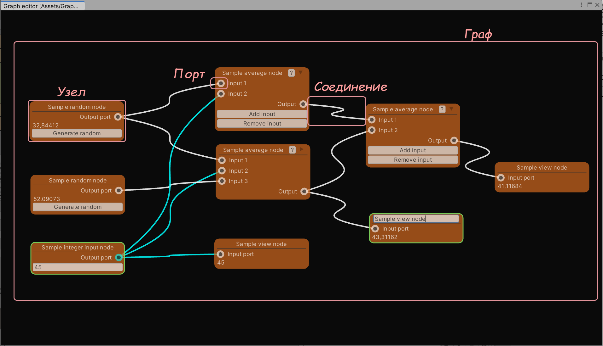
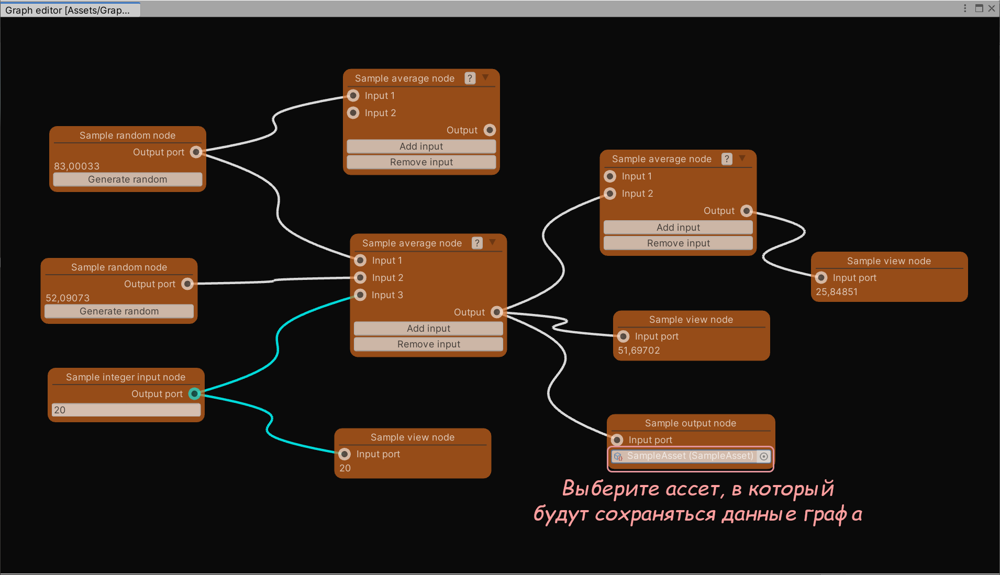
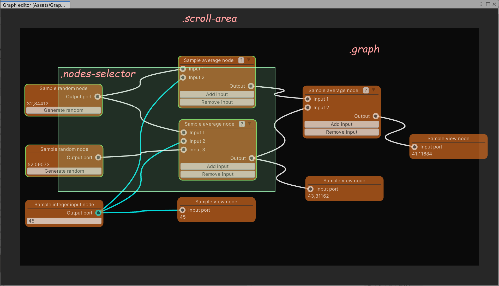
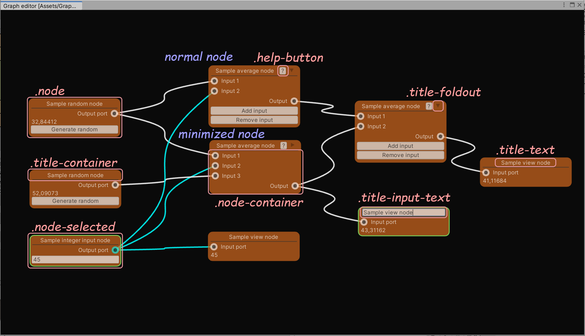
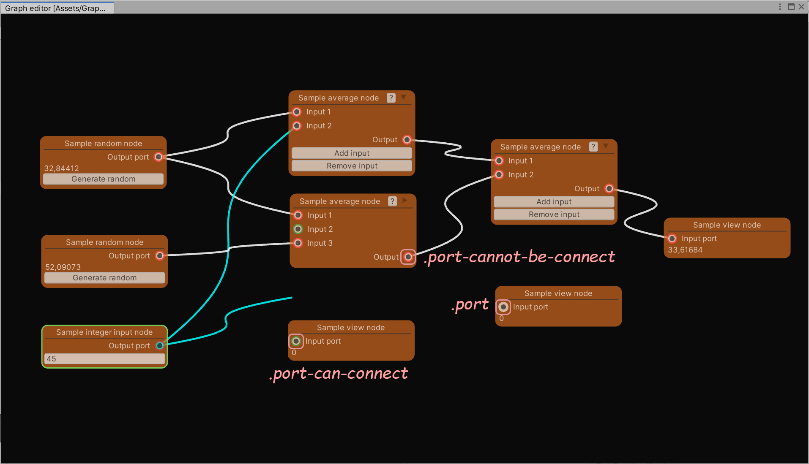
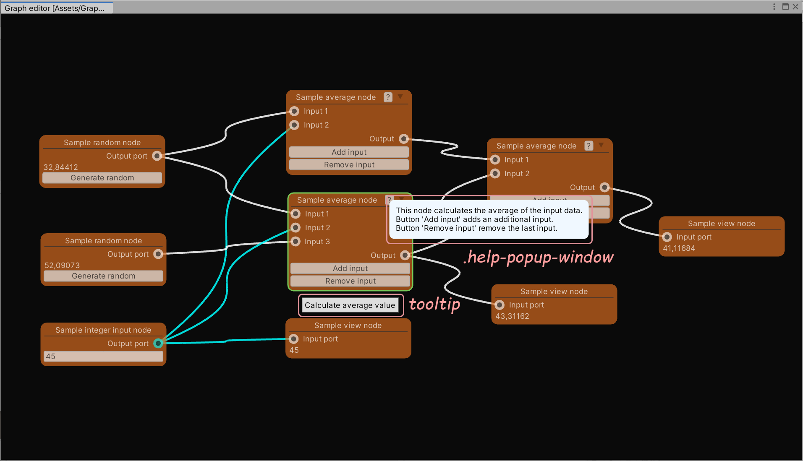

# Редактор графов для Unity3d

[Graph editor Version 1.2.](http://u3d.as/22My)

Copyright (c) Marshalkin Aleksey <megalanthus@gmail.com>

[Asset store](https://assetstore.unity.com/publishers/50181)

[Github](https://github.com/megalanthus)


# Содержание
- [Введение](#intro)
  - [Возможности](#intro-features)
  - [Узлы](#intro-node)
  - [Порты](#intro-port)
- [Начало работы](#getting-started)
  - [Создание графа](#create-graph)
  - [Управление редактором](#editor-control)
  - [Контекстные меню](#context-menu)
  - [Расчет графа](#calculate-graph)
- [Примеры скриптов пользовательского графа](#samples)
  - [Создание графа](#create-custom-graph)
  - [Создание порта](#create-custom-port)
  - [Создание данных узла](#create-custom-node-data)
  - [Создание узла](#create-custom-node)
  - [Связь данных с визуальным представлением узла](#bind-data)
  - [Связь портов с визуальным представлением узла](#bind-port)
  - [Динамическое изменение узла](#dynamic-change-node)  
  - [Вывод данных из графа в ассет](#output-data)
  - [Ввод данных в граф из ассета](#input-data)
- [Атрибуты](#attributes)
  - [CreateAssetMenu](#attribute-create-asset-menu)
  - [Design](#attribute-design)
  - [GraphDesign](#attribute-graph-design)
  - [MinimizedDesign](#attribute-minimized-design)
  - [Node](#attribute-node)
  - [NodeHelp](#attribute-node-help)
  - [NodeTooltip](#attribute-node-tooltip)
  - [Port](#attribute-port)
  - [Serializable](#attribute-serializable)
- [Шаблоны и стили](#template-and-styles)
  - [Именование файлов](#template-and-styles-file-naming)
  - [Граф](#template-and-styles-graph)
  - [Узел](#template-and-styles-node)
  - [Порт](#template-and-styles-port)
  - [Соединение](#template-and-styles-connection)
  - [Всплывающее окно помощи](#template-and-styles-help-window)
- [Скрипты](#scripts)
  - [GraphEditor.cs](#scripts-graph-editor)
  - [Graph.cs](#scripts-graph)
  - [Node.cs](#scripts-node)
  - [Port.cs](#scripts-port)
  - [Utils.cs](#scripts-utils)
- [Перечисления](#enums)
  - [PortDirection.cs](#enums-port-direction)
  - [PortTypeConnection.cs](#enums-port-type-connection)
- [История изменений](#history)
  - [Версия 1.0](#history-1-0)
  - [Версия 1.1](#history-1-1)
  - [Версия 1.2](#history-1-2)


<a name="intro"></a>
# Введение
Редактор графов это расширение для Unity3d. Позволяет создавать пользовательские графы на основе узлов. Может использоваться для расчета данных или создания ассетов на основе графа. Граф сохраняется в виде единого asset файла.




<a name="intro-features"></a>
## Возможности
- Только для редактора (не для рантайм режима!).
- Основан на [UIElements](https://docs.unity3d.com/Manual/UIElements.html).
- Поддерживается Undo/redo.
- Масштабирование графа.
- Автопрокрутка графа при перетаскивании/соединении узлов.
- Автоматический расчет графа.
- Расширяемое контекстное меню графа и узлов.
- Легкое создание пользовательских узлов.
- Перенаименование узлов.
- Групповое перемещение/клонирование/удаление узлов графа.
- Возможность соединять порты различного типа.
- Подсветка возможности соединения портов при захвате порта.
- Полная настройка внешнего вида с помощью uxml шаблонов и uss стилей.
- Отдельные шаблоны для нормального/свернутого состояния узла.
- Возможность создавать всплывающие подсказки и всплывающие окна помощи для узлов.
- Автоматическое создание экземпляра данных для узла.
- Различные обработчики событий позволяют реализовать различный дополнительный функционал.


<a name="intro-node"></a>
## Узлы
Каждый узел имеет свои поля данных. Каждый узел может иметь произвольное количество портов. Узлы графа могут соединяться с помощью портов. При расчете графа данные между узлами передаются через порты.


<a name="intro-port"></a>
## Порты
Порты служат для соединения узлов. Каждый порт узла имеет свой тип, направление (вход/выход), а также тип соединения (одиночное/множественное). Порты могут быть разного типа. Имена портов должны быть уникальны в пределах одного узла.

Правила соединения портов:
- Порты с одинаковым направлением не могут быть соединены.
- Порт с одиночным типом соединения может быть соединен только с одним портом.
- По умолчанию порты разного типа не могут быть соединены. Чтобы разрешить соединение портов разного типа необходимо переопределить метод [CanConnectPorts](#scripts-graph-can-connect-ports)


<a name="getting-started"></a>
# Начало работы


<a name="create-graph"></a>
## Создание графа
Создать ассет графа можно двумя способами (при создании пользовательского графа путь меню может быть изменен):
1. Через главное меню Assets->Create->Graph->Sample graph.
2. Через контекстное меню Create->Graph->Sample graph.


<a name="editor-control"></a>
## Управление редактором
В окне редактора:
- **Левая кнопка мыши**: выделить узел.
- **Левая кнопка мыши + перемещение**: прямоугольное выделение узлов.
- **Shift + Левая кнопка мыши**: добавить узел к выделенным.
- **Ctrl + Левая кнопка мыши**: перемещение графа.
- **Средняя кнопка мыши + перемещение**: перемещение графа.
- **Правая кнопка мыши**: контекстное меню.
- **Колесо мыши**: изменение масштаба графа.
- **+**: увеличение масштаба графа.
- **-**: уменьшение масштаба графа.
- **/**: сброс масштаба графа.
- **Delete**: удалить выбранные узлы.
- **Shift + Delete**: разорвать все связи выделенных узлов.
- **Ctrl + D**: клонировать выбранные узлы.

В окне узла:
- **Левая кнопка мыши + перемещение**: перемещение выделенных узлов.
- **Правая кнопка мыши**: контекстное меню.
- **Двойной клик левой кнопкой мыши на заголовке**: перенаименование узла.

На порте:
- **Левая кнопка мыши**: создание связи с другим портом.
- **Правая кнопка мыши**: разорвать все связи для текущего порта.


<a name="context-menu"></a>
## Контекстные меню
Контекстное меню редактора:
- **Create node**: создать узел.
- **Set scale 100%**: установить масштаб графа на 100%. 
- **Calculate graph**: пересчитать граф.

Контекстное меню узла:
- **Clone node** - дублировать выделенные узлы.
- **Remove node** - удалить выделенные узлы.
- **Disconnect all ports** - разорвать все связи выделенных узлов.
- **Calculate node** - пересчитать узел и все зависимые от него узлы.

Для добавления пользовательских пунктов меню необходимо переопределить метод OnCreateContextMenu [графа](#scripts-graph-on-create-context-menu) или [узла](#scripts-node-on-create-context-menu).

Пример добавления меню, SampleAverageNode.cs:
```cs
namespace GraphEditor.Samples
{
    public class SampleAverageNode : Node
    {
        public override void OnCreateContextMenu(DropdownMenu dropdownMenu)
        {
            dropdownMenu.AppendSeparator();
            dropdownMenu.AppendAction("Add input", action => AddInput());
            dropdownMenu.AppendAction("Remove input", action => RemoveInput());
        }

        private void AddInput()
        {
            string portName = $"Input {CountInputPorts + 1}";
            CreatePort(typeof(SampleFloatPort), portName, PortDirection.Input, PortTypeConnection.Single);
            Synchronize();
        }

        private void RemoveInput()
        {
            if (CountInputPorts <= 2) return;
            RemovePort(InputPortsByType<SampleFloatPort>().Last());
            Synchronize();
        }
    }
}
```


<a name="calculate-graph"></a>
## Расчет графа
Граф расчитывается автоматически. Если граф зациклен, то будет произведен частичный расчет, а в консоль будет выведено предупреждение.

Для выключения автоматического расчета необходимо переопределить свойство графа [AutoCalculate](#scripts-graph-auto-calculate):
```cs
    public sealed class SampleGraph : Graph
    {
        public override bool AutoCalculate => false;
    }
```

Граф полностью пересчитывается при:
- открытии графа.
- после операции undo/redo.
- вызове метода [ForceCalculateGraph](#scripts-graph-force-calculate-graph).
- при выборе пункта контекстного меню Calculate graph.
- при нажатии на кнопку Calculate graph в окне инспектора (имеет смысл, если в процессе расчета графа генерируется ассет или происходят изменения в проекте).

Частичный пересчет графа выполняется:
- при соединении/разъединении портов.
- вызове метода [Calculate](#scripts-node-calculate).
- при выборе пункта контекстного меню Calculate node.

Расчет и передачу данных в выходные порты необходимо делать в переопределенном методе [OnCalculate](#scripts-node-on-calculate). Данные переданные в порт не сериализуются и не будут сохранены в ассете графа.

SampleAverageNode.cs:
```cs
namespace GraphEditor.Samples
{
    public class SampleAverageNode : Node
    {
        //В методе расчета посчитаем среднее значение и запишем данные в выходной порт
        public override void OnCalculate()
        {
            FindPortByName<SampleFloatPort>(OutputPort).Value = GetAverage();
        }

        private void AddInput()
        {
            string portName = $"Input {CountInputPorts + 1}";
            CreatePort(typeof(SampleFloatPort), portName, PortDirection.Input, PortTypeConnection.Single);
            Synchronize();
            //После добавления нового порта пересчитаем узел
            Calculate();
        }

        private float GetAverage()
        {
            double average = 0;
            foreach (SampleFloatPort port in InputPortsByType<SampleFloatPort>()) average += port.Value;
            return (float) (average / CountInputPorts);
        }
    }
}
```

SampleViewNode.cs:
```cs
namespace GraphEditor.Samples
{
    public class SampleViewNode : Node
    {        
        public override void OnCalculate()
        {
            UpdateValue();
        }

        //сохраним данные прочитанные из порта
        private void UpdateValue()
        {
            SampleFloatPort inputPort = FindPortByName<SampleFloatPort>(InputPort);
            Data.Value = inputPort.Value;
        }
    }
}
```

<a name="samples"></a>
# Примеры создания скриптов пользовательского графа
Файлы примеров можно найти в каталоге Samples.
- **SampleGraph.cs**: класс графа.
- **SampleIntInputNode.cs**: класс узла (ввод целочисленных значений).
- **SampleIntInputNodeData.cs**: класс данных для узла SampleIntInputNode.
- **SampleRandomNode.cs**: класс узла (генерация случайного числа с плавающей запятой).
- **SampleRandomNodeData.cs**: класс данных для узла SampleRandomNode.
- **SampleAverageNode.cs**: класс узла (расчет среднего значения).
- **SampleViewNode.cs**: класс узла (просмотр полученного значения).
- **SampleViewNodeData.cs**: класс данных для SampleViewNode.
- **SampleOutputNode.cs**: класс узла (вывод полученного значения).
- **SampleOutputNodeData.cs**: класс данных для SampleOutputNode.
- **SampleIntPort.cs**: класс порта (передача целочисленных значений).
- **SampleFloatPort.cs**: класс порта (передача значений с плавающей точкой).
- **SampleAsset**: класс ассета (данные ассета генерируются с помощью SampleOutputNode).


<a name="create-custom-graph"></a>
## Создание графа
- Создать скрипт и сделать его наследником от [Graph](#scripts-graph).
- Добавить атрибут [Serializable](#attribute-serializable).
- Добавить атрибут [CreateAssetMenu](#attribute-create-asset-menu).

Опционально:
- Создать стиль uss для графа.
- Добавить атрибут [GraphDesign](#attribute-graph-design).

SampleGraph.cs:
```cs
using System;
using GraphEditor.Core;
using GraphEditor.Core.Attributes;
using UnityEngine;

namespace GraphEditor.Samples
{
    [Serializable]
    [CreateAssetMenu(fileName = "SampleGraph", menuName = "Graph/Sample graph", order = 5000)]
    [GraphDesign("Samples/SampleGraphStyle.uss")]
    public sealed class SampleGraph : Graph
    {
    }
}
```

SampleGraphStyle.uss:
```css
.graph {
    background-color: rgb(10, 10, 10);
}
```


<a name="create-custom-port"></a>
## Создание порта
- Создать скрипт и сделать его наследником от [Port](#scripts-port).
- Добавить атрибут [Serializable](#attribute-serializable).

Опционально:
- Создать шаблон uxml и стиль uss для порта.
- Добавить атрибут [Design](#attribute-design).

SampleIntPort.cs:
```cs
using System;
using GraphEditor.Core;
using GraphEditor.Core.Attributes;

namespace GraphEditor.Samples
{
    [Serializable]
    [Design("Samples/SamplePort.uxml", "Samples/SampleIntPortStyle.uss")]
    public sealed class SampleIntPort : Port
    {
    }
}
```

SamplePort.uxml:
```xml
<UXML xmlns="UnityEngine.UIElements">
    <VisualElement class="pin"/>
</UXML>
```

SampleIntPortStyle.uss:
```css
.port {
    background-color: aqua;
}

.pin{
    background-color: black;
    flex-grow: 1;
    border-radius: 4;
}
```


<a name="create-custom-node-data"></a>
## Создание данных узла
- Создать скрипт и сделать его наследником от ScriptableObject.
- Добавить атрибут [Serializable](#attribute-serializable).
- Добавить поля данных.

SampleViewNodeData.cs:
```cs
using System;
using UnityEngine;

namespace GraphEditor.Samples
{
    [Serializable]
    public class SampleViewNodeData : ScriptableObject
    {
        public float Value;
    }
}
```


<a name="create-custom-node"></a>
## Создание узла
- Создать скрипт и сделать его наследником от [Node](#scripts-node).
- Добавить атрибут [Serializable](#attribute-serializable).
- Добавить атрибут [Node](#attribute-node).
- Указать тип данных, которые будут использоваться узлом.
- Создать шаблон uxml и стиль uss (опционально) для узла.
- Добавить атрибут [Design](#attribute-design).

Опционально:
- Создать шаблон свернутого состояния uxml и стиль uss для узла.
- Добавить атрибут [MinimizedDesign](#attribute-minimized-design).
- Создать для всплывающего окна помощи шаблон uxml и стиль uss для узла.
- Добавить атрибут [NodeHelp](#attribute-node-help).
- Для создания всплывающей подсказки добавить атрибут [NodeTooltip](#attribute-node-tooltip).
- Для автоматического создания портов узла добавить атрибут [Port](#attribute-port).

SampleViewNode.cs:
```cs
using System;
using GraphEditor.Core;
using GraphEditor.Core.Attributes;

namespace GraphEditor.Samples
{
    [Serializable]
    [Node("Sample view node", typeof(SampleGraph))]
    [Design("Samples/SampleViewNode.uxml", "Samples/SampleNodeStyle.uss")]
    [Port(typeof(SampleFloatPort), InputPort, PortDirection.Input, PortTypeConnection.Single)]
    public class SampleViewNode : Node
    {
        private const string InputPort = "Input";

        //Указываем тип данных
        public override Type TypeNodeData => typeof(SampleViewNodeData);
        
        //Переопределяем поле, для более удобного доступа к данным
        public new SampleViewNodeData Data => (SampleViewNodeData) base.Data;
    }
}
```

SampleViewNode.uxml:
```xml
<UXML xmlns="UnityEngine.UIElements" xmlns:ge="GraphEditor.UIElements">
    <VisualElement class="node-row">
        <ge:PortVisual name="Input"/>
        <Label class="port-label" text="Input port"/>
        <VisualElement class="node-spacer"/>
    </VisualElement>
    <Label binding-path="Value"/>
</UXML>
```

SampleNodeStyle.uss:
```css
.node {
    background-color: chocolate;
    opacity: 0.7;
}

.node-selected {
    border-color: rgb(106, 255, 114);
}

.title-text, .unity-label {
    color: rgb(255, 255, 255);
    padding: 0 4;
}

.port-label {
    color: rgb(255, 255, 255);
    -unity-text-align: middle-center;
}

.node-row {
    flex-direction: row;
}

.node-spacer {
    flex-grow: 1;
}
```


<a name="bind-data"></a>
## Связь данных с визуальным представлением узла
Поля шаблона uxml c атрибутом binding-path будут автоматически связаны с данными узла.

SampleViewNode.uxml:
```xml
<UXML xmlns="UnityEngine.UIElements" xmlns:ge="GraphEditor.UIElements">
    ...
    <Label binding-path="Value"/>
</UXML>
```

Метка с атрибутом binding-path="Value" будет привязана к данным соответствующего узла SampleViewNode.Data.Value.


<a name="bind-port"></a>
## Связь порта с визуальным представлением узла
Порты будут связаны автоматически с портами узла по имени. PortVisual визуальный элемент порта, находится в пространстве GraphEditor.UIElements.

SampleViewNode.uxml:
```xml
<UXML xmlns="UnityEngine.UIElements" xmlns:ge="GraphEditor.UIElements">
        ...
        <ge:PortVisual name="Input"/>
        ...
</UXML>
```
Порт с именем Input будет связан с визуальным элементом <ge:PortVisual name="Input"/> шаблона.


<a name="dynamic-change-node"></a>
## Динамическое изменение узла
В методе [OnCreateContent](#scripts-node-on-create-content) подписываемся на события от кнопок. В обработчиках кнопок, после создания/удаления дополнительных портов вызываем метод [Synchronize](#scripts-node-synchronize).

```cs
namespace GraphEditor.Samples
{
    public class SampleAverageNode : Node
    {
        public override void OnCreateContent(VisualElement nodeVisual)
        {
            Button addInputButton = nodeVisual.contentContainer.Q<Button>("add-input");
            if (addInputButton != null) addInputButton.clicked += AddInput;
            Button removeInputButton = nodeVisual.contentContainer.Q<Button>("remove-input");
            if (removeInputButton != null) removeInputButton.clicked += RemoveInput;
        }

        private void AddInput()
        {
            string portName = $"Input {CountInputPorts + 1}";
            CreatePort(typeof(SampleFloatPort), portName, PortDirection.Input, PortTypeConnection.Single);
            Synchronize();
            Calculate();
        }

        private void RemoveInput()
        {
            if (CountInputPorts <= 2) return;
            RemovePort(InputPortsByType<SampleFloatPort>().Last());
            Synchronize();
            Calculate();
        }
    }
}
```

В методе [OnSynchronize](#scripts-node-on-synchronize) синхронизируем визуальное представление узла с данными. При появлении новых портов добавляем визуальное представление, и удаляем для несуществующих.

```cs
namespace GraphEditor.Samples
{
    public class SampleAverageNode : Node
    {
        private const string BasePath = "Samples/";
        private const string NodeItemTemplateUxml = BasePath + "SampleAverageNodeItem.uxml";
        private const string TemplatePortClassUss = "template-port";

        public override void OnSynchronize(VisualElement nodeVisual)
        {
            VisualElement portContainer = nodeVisual.contentContainer.Q("port-container");
            portContainer.Query(classes: TemplatePortClassUss).ForEach(portVisual =>
            {
                if (FindPortByName(portVisual.name) == null) portVisual.parent.RemoveFromHierarchy();
            });
            foreach (Port port in InputPorts)
            {
                if (portContainer.Q(port.name) != null) continue;
                VisualElement template = Utils.LoadTemplate(NodeItemTemplateUxml);
                portContainer.Add(template);
                template.AddToClassList("node-row");
                template.Q(classes: TemplatePortClassUss).name = port.name;
                template.Q<Label>().text = port.name;
            }
        }
    }
}
```

Шаблон SampleAverageNodeItem.uxml:
```xml
<UXML xmlns="UnityEngine.UIElements" xmlns:ge="GraphEditor.UIElements">
    <ge:PortVisual class="template-port"/>
    <Label class="port-label"/>
    <VisualElement class="node-spacer"/>
</UXML>
```


<a name="output-data"></a>
## Вывод данных из графа в ассет
Пример ассета, генерируемого графом, SampleAsset.cs:

```cs
using System;
using UnityEngine;

namespace GraphEditor.Samples
{
    [Serializable]
    [CreateAssetMenu(fileName = "SampleAsset", menuName = "Graph/Sample asset", order = 5000)]
    public class SampleAsset : ScriptableObject
    {
        public float SampleData;
    }
}
```

В данных узла создаем ссылку на ассет:

```cs
using UnityEngine;

namespace GraphEditor.Samples
{
    public class SampleOutputNodeData : ScriptableObject
    {
        public SampleAsset Asset;
    }
}
```

Вывод данных на примере узла SampleOutputNode:

```cs
namespace GraphEditor.Samples
{
    public class SampleOutputNode : Node
    {
        private const string InputPort = "Input";

        public override Type TypeNodeData => typeof(SampleOutputNodeData);
        public new SampleOutputNodeData Data => (SampleOutputNodeData) base.Data;

        //при создании узла указываем тип данных для поля выбора объекта.
        public override void OnCreateContent(VisualElement nodeVisual)
        {
            ObjectField objectField = nodeVisual.Q<ObjectField>("asset");
            objectField.objectType = typeof(SampleAsset);
            objectField.RegisterCallback<ChangeEvent<Object>>(evt =>
            {
                Data.Asset = evt.newValue as SampleAsset;
                UpdateAsset();
            });
        }

        public override void OnChangeConnections()
        {
            UpdateAsset();
        }

        public override void OnCalculate()
        {
            UpdateAsset();
        }

        //выводим данные в файл ассета
        private void UpdateAsset()
        {
            SampleFloatPort inputPort = FindPortByName<SampleFloatPort>(InputPort);
            if (Data.Asset != null) Data.Asset.SampleData = inputPort.Value;
        }
    }
}
```

Шаблон SampleOutputNode.uxml:
```xml
<UXML xmlns="UnityEngine.UIElements" xmlns:ue="UnityEditor.UIElements" xmlns:ge="GraphEditor.UIElements">
    <VisualElement class="node-row">
        <ge:PortVisual name="Input"/>
        <Label class="port-label" text="Input port"/>
        <VisualElement class="node-spacer"/>
    </VisualElement>
    <ue:ObjectField name="asset" binding-path="Asset" allow-scene-objects="false"/>
</UXML>
```

Создаем новый ассет в каталоге проекта, через меню Create->Graph->Sample asset. И выбираем его в узле SampleOutputNode. Теперь при расчете графа данные в ассете будут обновляться.



<a name="input-data"></a>
## Ввод данных в граф из ассета
Ввод данных в граф из асссета производится аналогично [выводу данных](#output-data)


<a name="attributes"></a>
# Атрибуты
Описание атрибутов.


<a name="attribute-create-asset-menu"></a>
## Атрибут CreateAssetMenu
Используется для добавления пункта меню. [Полное описание](https://docs.unity3d.com/ScriptReference/CreateAssetMenuAttribute.html).

Применим для [графов](#scripts-graph).


<a name="attribute-design"></a>
## Атрибут Design
Атрибут задает стиль узла или порта.

Применим для [узлов](#scripts-node) и для [портов](#scripts-port)

**\[Design(Template, Style)\]**

- Template - путь к файлу шаблона окна.
- Style - путь к файлу стиля.


<a name="attribute-graph-design"></a>
## Атрибут GraphDesign
Атрибут задает стиль графа.

Применим для [графов](#scripts-graph).

**\[GraphDesign(Style, ConnectionWidth, MinScale, MaxScale)\]**

- Style - путь к файлу стиля.
- ConnectionWidth - ширина соединений, по умолчанию 3.
- MinScale - минимальный масштаб графа, по умолчанию 0.3.
- MaxScale - максимальный масштаб графа, по умолчанию 1.


<a name="attribute-minimized-design"></a>
## Атрибут MinimizedDesign
Атрибут задает стиль узла в свернутом состоянии.

Применим для [узлов](#scripts-node).

**\[MinimizedDesign(Template, Style)\]**

- Template - путь к файлу шаблона окна.
- Style - путь к файлу стиля.


<a name="attribute-node"></a>
## Атрибут Node
Атрибут задает в каких графах может быть использовать узел. Для использования узла в нескольких графах необходимо для каждого типа графа добавить атрибут.

Применим для [узлов](#scripts-node).

**\[Node(MenuItem, TypeGraph)\]**

- MenuItem - пункт будет добавлен в контекстное меню графа с типом TypeGraph в раздел Create node.
- TypeGraph - тип графа в котором будет использоваться узел.


<a name="attribute-node-help"></a>
## Атрибут NodeHelp
Атрибут устанавливает всплывающее окно помощи для узла.

Применим для [узлов](#scripts-node).

**\[NodeHelp(Template, Style)\]**

- Template - путь к файлу шаблона окна.
- Style - путь к файлу стиля.


<a name="attribute-node-tooltip"></a>
## Атрибут NodeTooltip
Атрибут устанавливает всплывающую подсказку для узла.

Применим для [узлов](#scripts-node).

**\[NodeTooltip(Tooltip)\]**

- Tooltip - текст всплывающей подсказки.


<a name="attribute-port"></a>
## Атрибут Port
Атрибут задает какой порт будет автоматически создан при создании нового узла. Допускается несколько атрибутов на одном узле. Имена портов должны быть уникальными в пределах одного узла.

Применим для [узлов](#scripts-node).

**\[Port(PortType, Name, Direction, TypeConnection)\]**

- PortType - тип порта.
- Name - название порта.
- Direction - направление порта, по умолчанию вход.
- TypeConnection - тип соединения порта, по умолчанию множественное.


<a name="attribute-serializable"></a>
## Атрибут Serializable
Необходим для корректного сохранения данных. [Полное описание](https://docs.unity3d.com/ScriptReference/Serializable.html).


<a name="template-and-styles"></a>
# Шаблоны и стили

<a name="template-and-styles-file-naming"></a>
## Именование файлов
Файлы шаблонов и стилей могут находиться в произвольном каталоге. Для того чтобы файлы не попали в сборку не нужно располагать их в каталоге Resources. Путь к файлам необходимо указывать относительно каталога проекта или относительно каталога Assets/GraphEditor/Skins/.

Примеры:
- Assets/MyDirectory/MyTemplate.uxml
- Samples/SampleNodeStyle.uss - будет загружен файл: Assets/GraphEditor/Skins/Samples/SampleNodeStyle.uss


<a name="template-and-styles-graph"></a>
## Граф


uss классы графа:

- .graph - базовый контейнер графа.
- .scroll-area - граница автоматической прокрутки графа.
- .nodes-selector - элемент выделения узлов.


<a name="template-and-styles-node"></a>
## Узел


uss классы узла:
- .node - базовый контейнер узла.
- .title-container - контейнер заголовка узла.
- .title-text - текст заголовка.
- .title-input-text - поле ввода названия узла.
- .help-button - кнопка помощи.
- .title-foldout - кнопка минимизации узла.
- .node-container - контейнер узла.
- .node-selected - стиль выделенного узла.

Для шаблона заданного с помощью атрибута [Design](#attribute-design) и [MinimizedDesign](#attribute-minimized-design) в качестве родителя будет установлен элемент с классом .node-container.


<a name="template-and-styles-port"></a>
## Порт


uss классы порта:
- .port - контейнер порта.
- .port-can-connect - стиль контейнера порта, если есть возможность соединить с другим (при попытке соединения).
- .port-cannot-be-connect - стиль контейнера порта, если нет возможности соединить с другим (при попытке соединения).

Для шаблона заданного с помощью атрибута [Design](#attribute-design) в качестве родителя будет установлен элемент с классом .port.


<a name="template-and-styles-connection"></a>
## Соединение
В качестве цвета соединения будет использоваться цвет выходного порта (color из элемента с классом .port). Ширина соединения можно задать с помощью атрибута [GraphDesign](#attribute-graph-design).


<a name="template-and-styles-help-window"></a>
## Всплывающее окно помощи


uss классы всплывающего окна помощи:
- .help-popup-window - родительский элемент окна.

Для шаблона заданного с помощью атрибута [NodeHelp](#attribute-node-help) в качестве родителя будет установлен элемент с классом .help-popup-window.
Всплывающая подсказка задается с помощью атрибута [NodeTooltip](#attribute-node-tooltip).

SampleAverageNodeHelp.uxml:
```xml
<UXML xmlns="UnityEngine.UIElements">
    <TextElement text="This node calculates the average of the input data."/>
    <TextElement text="Button 'Add input' adds an additional input."/>
    <TextElement text="Button 'Remove input' remove the last input."/>
</UXML>
```


<a name="scripts"></a>
# Скрипты


<a name="scripts-graph-editor"></a>
## GraphEditor.cs
Редактор графа.

**Методы**
- ***static void OpenGraph(string path)***
  Открыть файл в редакторе.
- ***static void CloseWindow()***
  Закрыть окно редактора.
- ***static void UpdateWindow()***
  Обновляет окно редактора.
- ***static void CenteringNode(Node node)***
  Центрирует и выделяет узел в окне редактора.


<a name="scripts-graph"></a>
## Graph.cs
Базовый абстрактный класс графа. Используется для хранения графа.

**Поля и свойства**
<a name="scripts-graph-auto-calculate"></a>
- ***bool AutoCalculate***
  Если истина, то будет выполняться автоматический расчет графа.
- ***int CountNodes***
  Количество узлов в графе.
- ***IEnumerable\<Node\> EnumNodes***
  Все узлы графа.

**Методы**
- ***Node CreateNode(Type nodeType, Vector2 position, string title, ScriptableObject initialData = null)***
  Создать узел.
- ***Node CloneNode(Node node, Vector2 position)***
  Создать клон узла.
- ***void RemoveNode(Node node)***
  Удалить узел.
- ***int CountNodesByType\<T\>()***
  Количество узлов в графе с учетом типа.
- ***IEnumerable\<Node\> EnumNodesByType\<T\>()***
  Все узлы графа с учетом типа.
<a name="scripts-graph-force-calculate-graph"></a>
- ***void ForceCalculateGraph()***
  Пересчитать весь граф.

**События (для обработки, переопределить метод)**
- ***void OnOpenGraph()***
  Вызывается при открытии графа.
- ***void OnClose()***
  Вызывается перед закрытием графа.
<a name="scripts-graph-on-create-context-menu"></a>
- ***void OnCreateContextMenu(DropdownMenu dropdownMenu)***
  Вызывается при создании контекстного меню графа, служит для добавления пользовательских пунктов меню.
- ***bool CanCreateNewNode(Type nodeType)***
  Метод определяет, можно ли создать новый узел данного типа.
- ***bool CanRemoveNode(Node node)***
  Метод определяет, можно ли удалить из графа данный узел.
<a name="scripts-graph-can-connect-ports"></a>
- ***bool CanConnectPorts(Port port1, Port port2)***
  Метод определяет, можно ли соединять порты с разными типами. Не вызывается для портов с одинаковым типом.
- ***void OnUndoRedoPerformed()***
  Вызывается при отмене/повторе действия.


<a name="scripts-node"></a>
## Node.cs
Базовый абстрактный класс узла.

**Поля и свойства**
- ***Type TypeNodeData***
  Тип файла класса с данными для узла. Экземпляр класса создается и удаляется автоматически.
- ***int CountPorts***
  Количество портов на узле.
- ***int CountInputPorts***
  Количество входных портов на узле.
- ***int CountOutputPorts***
  Количество выходных портов.
- ***IEnumerable\<Port\> EnumPorts***
  Все порты узла.
- ***ScriptableObject Data***
  Ссылка на экземпляр класса данных с типом TypeNodeData.
- ***Graph Graph***
  Ссылка на граф.
- ***string Title***
  Заголовок узла.
- ***bool IsMinimized***
  Если истина, то узел минимизирован.

**Методы**
- ***Port CreatePort(Type portType, string portName, PortDirection direction = PortDirection.Input, PortTypeConnection typeConnection = PortTypeConnection.Multiple)***
  Создание нового порта.
- ***void RemovePort(Port port)***
  Удаление порта.
- ***void DisconnectAllPorts()***
  Разорвать все соединения портов, для всех портов узла.
- ***Port FindPortByName(string portName)***
  Поиск порта по имени.
- ***T FindPortByName\<T\>(string portName)***
  Поиск порта по имени с учетом типа порта.
- ***int CountPortsByType\<T\>()***
  Количество портов с учетом типа. 
- ***int CountInputPortsByType\<T\>()***
  Количество входных портов с учетом типа. 
- ***int CountOutputPortsByType\<T\>()***
  Количество выходных портов с учетом типа.
- ***IEnumerable\<T\> EnumPortsByType\<T\>()***
  Все порты узла с учетом типа.
- ***IEnumerable\<T\> InputPortsByType\<T\>()***
  Все входные порты узла с учетом типа.
- ***IEnumerable\<T\> OutputPortsByType\<T\>()***
  Все выходные порты узла с учетом типа.
<a name="scripts-node-synchronize"></a>
- ***void Synchronize()***
  Синхронизация визуального представления узла с данными.
<a name="scripts-node-calculate"></a>
- ***void Calculate()***
  Пересчитать узел и все зависимые узлы.

**События (для обработки, переопределить метод)**
- ***void OnCreate()***
  Вызывается однократно при создании (клонировании) узла. В этом методе удобно инициализировать уникальные данные узла. Не вызывается при открытии графа.
<a name="scripts-node-on-create-content"></a>
- ***void OnCreateContent(VisualElement nodeVisual)***
  Вызывается при создании содержимого узла. В этом методе необходимо подписываться на события визуальных элементов.
<a name="scripts-node-on-synchronize"></a>
- ***void OnSynchronize(VisualElement nodeVisual)***
  Вызывается при обновлении узла. В этом методе необходимо синхронизировать (создавать/удалять) динамические элементы интерфейса.
<a name="scripts-node-on-create-context-menu"></a>
- ***void OnCreateContextMenu(DropdownMenu dropdownMenu)***
  Вызывается при создании контекстного меню узла, служит для добавления пользовательских пунктов меню.
- ***void OnChangeConnections()***
  Вызывается при изменении связей портов. Не вызывается по команде undo/redo.
- ***void OnChangeData()***
  Вызывается при изменении полей узла.
<a name="scripts-node-on-calculate"></a>
- ***void OnCalculate()***
  Вызывается при расчете узла. В этом методе необходимо отправить данные в выходные порты (установить свойство Value выходных портов).
- ***void OnRemove()***
  Вызывается перед удалением узла.


<a name="scripts-port"></a>
## Port.cs
Базовый абстрактный класс порта.

**Поля и свойства**
- ***PortDirection Direction***
  Направление порта.
- ***PortTypeConnection TypeConnection***
  Тип соединения порта (одиночный/многократный).
- ***Node Node***
  Родительский узел.
- ***IEnumerable\<Port\> ConnectedTo***
  Список подсоединенных портов.
- ***int CountConnections***
  Количество подсоединенных портов.
- ***object Value***
  Данные (ссылка на данные) для обмена между узлами.
- ***object RawValue***
  Сырые данные записанные в порт.

**Методы**
- ***void ConnectTo(Port port)***
  Соединить порт с другим.
- ***bool IsCanConnectTo(Port port)***
  Проверяет, можно ли соединить порт с другим.
- ***bool IsConnectedTo(Port port)***
  Проверяет, соединен ли текущий порт с другим.
- ***void Disconnect()***
  Разрывает все соединения порта.
- ***virtual object GetValueInputPort())***
  Вызывается при получении данных из входного порта. Если порт не соединен, или соединений более одного то возвращается default, иначе возвращается значение из подсоединенного порта. Для изменения логики получения данных из входного порта метод нужно переопределить и вернуть необходимое значение.


<a name="scripts-utils"></a>
## Utils.cs
Вспомогательные функции. [Именование файлов](#template-and-styles-file-naming).

- ***static void LoadStyleSheetToElement(VisualElement element, string pathStyleSheet)***
  Загрузка файла стилей для визуального элемента.
- ***static VisualElement LoadTemplate(string pathTemplate, string pathStyleSheet)***
  Загрузка шаблона и стилей для него.
- ***static void LoadTemplate(VisualElement parent, string pathTemplate, string pathStyleSheet)***
  Загрузка шаблона и стилей для него.


<a name="enums"></a>
# Перечисления


<a name="enums-port-direction"></a>
## PortDirection.cs
Направление порта.
- Input
- Output


<a name="enums-port-type-connection"></a>
## PortTypeConnection.cs
Тип соединения порта.
- Single
- Multiple


<a name="history"></a>
# История изменений


<a name="history-1-0"></a>
## Версия 1.0
Оригинальная версия.


<a name="history-1-1"></a>
## Версия 1.1
- Исправлена некорректная отрисовка соединений.
- Исправлен баг при скролле графа.
- Метод GraphEditor.CloseEditorWindow перенаименован в GraphEditor.CloseWindow.
- Добавлен метод GraphEditor.UpdateWindow.
- Добавлен метод GraphEditor.CenteringNode.
- Удален метод Graph.Update.
- Добавлено свойство Graph.AutoCalculate, позволяющее выключить авторасчет графа.
- Метод Node.OnCreateNode перенаименован в Node.OnCreate.
- Добавлен метод Node.OnRemove.


<a name="history-1-2"></a>
## Версия 1.2
- Исправлена ошибка при динамическом изменении узла.
- Исправлена ошибка в методе GraphEditor.CenteringNode.